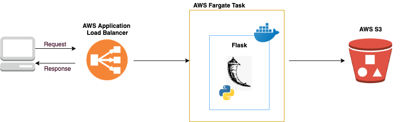

## This project allows user to track availability of hospital beds in the US

### System Architecture



### Technologies Used
```
AWS CDK: Provision cloud infrastructure
AWS Application Load Balancer: Interact with clients
AWS Fargate Task: Serverless compute engine for containers
AWS S3: Store objects
```

### How to run locally
```
1. Build and activate a virtual environment: 
python3 -m venv env
source env/bin/activate

2. Install packages:
pip3 install aws_cdk.core
pip3 install aws_cdk.aws_ec2
pip3 install aws_cdk.aws_ecs

3. Install AWS CDK CLI:
npm install aws-cdk

4. Boostrap infrastructure:
node_modules/aws-cdk/bin/cdk bootstrap

5. Deploy infrastructure:
node_modules/aws-cdk/bin/cdk deploy
```

### How to pull latest changes from subdirectory
This project uses git submodules to deploy api and web from infra repo.
```
git submodule update --remote <submodule_name>
```

### How to revert changes to submodule directories
```
git submodule foreach git reset --hard HEAD
git submodule update
git submodule foreach "git checkout master; git pull"
git submodule foreach git clean -f
```

### How to delete submodule directories
```
git rm -f submodule/
rm -rf .git/modules/submodule/
```